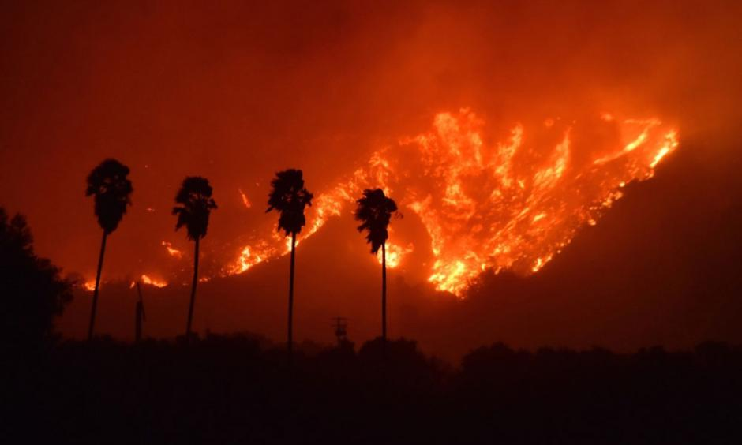

# False Color Imagery of Thomas Fire

#### Emma Bea Mitchell | November 22, 2014




Image of the Thomas Fire in 2017. Image is located in the images folder.

## About:

This repository contains a notebook hwk4-task2-fire-perimeter-MITCHELL.ipynb, loading in California fire shapefile data, subsetting for the 2017 Thomas Fire and exporting that data as a shapefile. That shapefile is in the data folder as thomas_fire.shp. It is used in the hwk4-task2-false-color-MITCHELL.ipynb notebook 

This repository also contains a notebook hwk4-task2-false-color-MITCHELL.ipynb, creating false color images of the Thomas Fire in Ventura and Santa Barbara Counties in California in 2017. The false color image highlights the effects of the devastating fire. Our final output is a false color image which is located in the repository as landsat_map_thomas_fire.png.

## Highlights:

- exporting selected data from California Fires shapefile
- creating true and false color imagery using landsat data
- analyzing false color imagery map using landsat and Thomas Fire data

## Data:

The `landsat` data is a simplified collection of bands (red, green, blue, near-infrared and shortwave infrared) from the Landsat Collection 2 Level-2 atmosperically corrected surface reflectance data, collected by the Landsat 8 satellite. The data was retrieved from the [Microsoft Planetary Computer Data Catalogue](https://planetarycomputer.microsoft.com/dataset/landsat-c2-l2) and pre-processed to remove data outside land and coarsen the spatial resolution. 

The `perimeters` data is a shapefile from [California Fires (all) from Data.gov](https://catalog.data.gov/dataset/california-fire-perimeters-all-b3436). "The fire perimeter and prescribed fire feature services provide a reasonable view of the spatial distribution of past large fires but is in no way complete. Some fires are missing because historical records were lost or damaged, were too small for the minimum cutoffs, had inadequate documentation or have not yet been incorporated into the database" (Data.gov).

The `Thomas_fire` data is a subset of the shapefile from [California Fires (all) from Data.gov](https://catalog.data.gov/dataset/california-fire-perimeters-all-b3436), which contains fire data for the whole of California. In the notebook `hwk4-task2-fire-perimeter-MITCHEL.ipynb` we data only from the 2017 Thomas Fire and export that data. In this notebook, we take advantage of that data for our `thomas_fire` variable. 

## References:

Microsoft Planetary Computer Data Catalogue, Landsat collection 2 Level-2 [Data file] Available from: https://planetarycomputer.microsoft.com/dataset/landsat-c2-l2. Access date: November 22, 2024.

Data.gov Data Catalogue, California Fire Perimeters (all) [Data file] Available from: https://catalog.data.gov/dataset/california-fire-perimeters-all-b3436. Access date: November 22, 2024.

## Repository Organization
``` python
eds220-hwk4/
│
├── README.md                     
├── hwk4-task2-fire-perimeter-MITCHELL.ipynb # Jupyter notebook for analysis
├── hwk4-task2-false-color-MITCHELL.ipynb                      
├── .gitignore                    
│
├── images/                       
│   ├── landsat_map_thomas_fire.png
│   ├── thomas_fire.jpeg
|
├── data/
│   ├── California_Fire_Perimeters_(all).cpg
│   ├── California_Fire_Perimeters_(all).dbf
│   ├── California_Fire_Perimeters_(all).prj
│   ├── California_Fire_Perimeters_(all).shp
│   ├── California_Fire_Perimeters_(all).shp.xml
│   ├── California_Fire_Perimeters_(all).shx
│   ├── California_Fire_Perimeters_(all).geojson
│   ├── thomas_fire.cpg
│   ├── thomas_fire.dbj
│   ├── thomas_fire.prj
│   ├── thomas_fire.shp
│   ├── thomas_fire.shx
```
